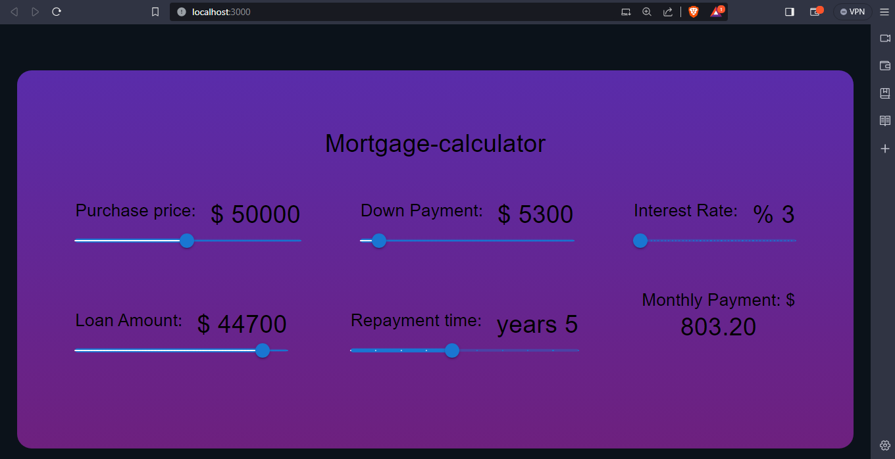

# MortgageCalculator

**MortgageCalculator** is a single web page created with React that allows you to calculate monthly EMI after taking out a loan.

## User Stories

The following functionalities are completed:

- [x] User can set the initial value of the loan.
- [x] User can set their down payment.
- [x] User can set the interest rate.
- [x] User can set the repayment time.
- [x] User can set loan amount.
- [x] Monthly payment is showed automatically.

## Demo

Here's a demo of implemented user stories:

## Open-source libraries used

- [React](https://react.dev/)
- [Material-UI](https://mui.com/)

## How to test

- Install NodeJs
- Clone repository.
- Navigate to local repo using commande prompt.
- Run npm install.
- Run npm start.
- Open [http://localhost:3000](http://localhost:3000) to view it in your browser.
